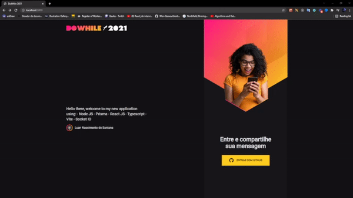

<h1 align="center">NLW Heat</h1>
---
<h1 align="center">
  
</h1>

# About 🚀

This project was developed during the NLW Heat, a free course to create a complete application with Node.js for backend, React.js for frontend, and React Native to mobile.

Here we can see the frontend, we made the authentication using the OAuth for github, and Socket.io to send and receive messages in real time.

# How to run ✔
The first thing that you need to do is access this repository
[server](https://github.com/Luan4560/nlw_heat_server) and follow the instructions on README on this repository to run the server.
After you get the server running, follow this steps.
```bash 
$ git clonehttps://github.com/Luan4560/nlw_heat_frontend.git
# Open the repository on your code editor and run
$ yarn or npm install #To install the depencies
# With the server running just run 
$ yarn dev 

The must open on ``http://localhost:3000.com``
```
---

# Techs
- [React JS](https://reactjs.org/)
- [Typescript](https://www.typescriptlang.org/)
- [Vite](https://vitejs.dev/)
- [Socket.io](https://socket.io/)
- [Sass](https://sass-lang.com/)

---
Developed by Luan Nascimento 🤘 with [RocketSeat](https://www.rocketseat.com.br/) as the provider.
